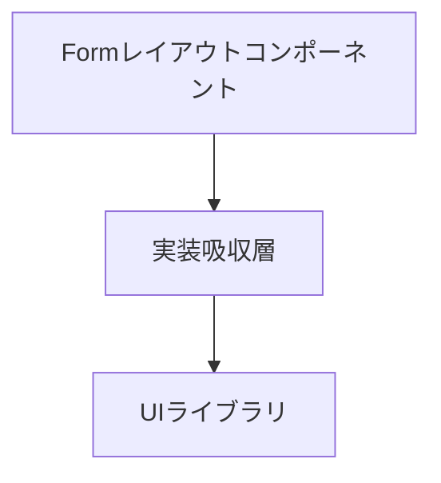

:::message
こちらの記事はReact Tokyo ミートアップ #2にて発表させていただいた内容をより深堀りした記事となっています。
登壇資料はこちらです。
https://speakerdeck.com/bmthd/formnofu-za-sanili-tixiang-kau
:::

## Formの悩み


このようなシンプルなフォームを想像してみてください。
これを実現するためのHTMLは以下のようなものになります。

```html:シンプルなHTMLフォームの例
  <div class="form-container">
    <form id="inquiryForm" action="https://example.com/api/inquiry" method="post">
      <div class="form-group">
        <label for="name">お名前</label>
        <input type="text" id="name" name="name" autocomplete="name" required>
      </div>
      <div class="form-group">
        <label for="email">メールアドレス</label>
        <input type="email" id="email" name="email" autocomplete="email" required>
      </div>
      <div class="form-group">
        <label for="message">お問い合わせ内容</label>
        <textarea id="message" name="message" rows="5" required></textarea>
      </div>
      <div class="button-container">
        <button type="submit" id="submitButton">送信</button>
      </div>
    </form>
  </div>
```

状態管理はブラウザが行ってくれるため、フォームの実装はシンプルです。
動的な要素はJavaScriptが行うため、見た目の実装に集中することができます。
これくらいシンプルに実装できるのであれば、嬉しいですよね。

これをReactでフォームを実装する際のコードで考えてみましょう。

```tsx:Reactでのフォーム実装例
import { useForm } from "react-hook-form";
import { Button, HStack, VStack, Label, Input, Textarea, ErrorMessage } from "@yamada-ui/react";
import { FC } from "react";
import { inquiryFormSchema, type InquiryForm } from "../schema";
import { inquiryAction } from "./actions";
import { valibotResolver } from "@hookform/resolvers/valibot";

export const InquiryForm: FC = () => {
  const {
    register,
    handleSubmit,
    formState: { isSubmitting, errors },
  } = useForm<InquiryForm>({
    resolver: valibotResolver(inquiryFormSchema),
  });

  return (
    <form onSubmit={handleSubmit(inquiryAction)}>
      <VStack>
        <Label>
          お名前
          <Input
            {...register("name")}
            type="text"
            autoComplete="name"
            required
            maxLength={255}
          />
        </Label>
        {errors.name && <ErrorMessage>{errors.name.message}</ErrorMessage>}
        <Label>
          メールアドレス
          <Input
            {...register("email")}
            type="email"
            autoComplete="email"
            required
            maxLength={255}
            pattern="^[^\s@]+@[^\s@]+\.[^\s@]+$"
          />
        </Label>
        {errors.email && <ErrorMessage>{errors.email.message}</ErrorMessage>}
        <Label>
          お問い合わせ内容
          <Textarea {...register("message")} required/>
        </Label>
        {errors.message && <ErrorMessage>{errors.message.message}</ErrorMessage>}
        <HStack alignSelf="end">
          <Button type="submit" loading={isSubmitting}>
            送信
          </Button>
        </HStack>
      </VStack>
    </form>
  );
};
```

Reactでフォームを実装する際は、React Hook Formを使用することが一般的です。
フォームのライブラリを使用することで、よりリッチなバリデーション処理や、取得した値を使った段階的な処理、送信状態の取得などを行うことができます。
状態管理を自作しなくても、フォームのライブラリ側で行ってくれるためとても便利なのですが、見ての通りJSX部分が複雑になりがちな問題があります。

**Conformを使うとここまで削れます！**

```tsx:Conformでのフォーム実装例
import { Form, TextareaField, TextField } from "@/ui/form";
import { Button, HStack, VStack } from "@yamada-ui/react";
import { FC, useActionState } from "react";
import { inquiryFormSchema } from "../schema";
import { inquiryAction } from "./actions";

export const InquiryForm: FC = () => {
  const [state, dispatch, isPending] = useActionState(inquiryAction, {
    status: "idle",
  });

  return (
    <Form
      schema={inquiryFormSchema}
      action={dispatch}
      options={{ lastResult: state.submissionResult }}
    >
      {({ field }) => (
        <VStack>
          <TextField name={field.name.name} label="お名前" autoComplete="name" />
          <TextField name={field.email.name} label="メールアドレス" autoComplete="email" />
          <TextareaField name={field.message.name} label="お問い合わせ内容" />
          <HStack alignSelf="end">
            <Button type="submit" loading={isPending}>
              送信
            </Button>
          </HStack>
          <FormDebug />
        </VStack>
      )}
    </Form>
  );
};
```

HTMLのように、フォームの見た目のみに集中できるようになりました！

## Conformのご紹介

Conformは、Server Actionsを前提に設計された新世代のフォームライブラリです。

React Hook Formとの違いのうちの一つが、inputなどの要素をライブラリ側に認識させるための登録の方法です。
RHFはその名前にもある通り、Reactに大きく依存した設計となっており、register関数を使ってinput要素のrefを直接管理します。
対して、Conformではname属性をスキーマによって登録します。
コンポーネントは独自の実装を必要とせず、一般的なname属性させ指定することができればそれだけで動作するようになります。

```tsx
import { useForm, getInputProps } from '@conform-to/react';

function Example() {
  const [form, field] = useForm();

  return (
    <form>
      <input {...getInputProps(field.password, { type: 'password' })} /> {/* Conformのユーティリティで一括設定 */}
      <input name={field.password.name} /> {/* Conformの型推論で設定 */}
      <input name="password" /> {/* 手動で設定 */}
    </form>
  )
}
```

register関数に似た仕組みとして`getXXXProps`という関数が入力欄の種類ごとに用意されており、それぞれの入力欄に適した属性を一括で設定することもできます。
これには、id、name属性、バリデーション制約、アクセシビリティ属性などが含まれます。
RHFでは手動で設定していたバリデーション制約をスキーマから導出することができ、更にはアクセシビリティにも対応できるのが決定的な違いとなります。
余談となりますが、内部実装は最近のライブラリによく見られるVanillaJSでの実装のため、今後React以外のライブラリへ対応できる余地が残されています。

## Conformと実装吸収層で実現する、シンプルなform実装

ここからは、はじめに紹介させていただいたシンプルな実装をどのように実現するかを説明していきます。



React Hook Formの例では、UIの構築、フォーム管理の組付け、バリデーション制約の設定、アクション、状態管理、エラーハンドリングなどを全て1つのコンポーネント内で行っていました。
複雑さの要因はここにあります。
単一責任の原則に従い、これらを分離していく必要があるのですが、React Hook Formを使用している場合、ここを実現する方法が難しくなります。
Conformでは実装がname属性にしか依存しないため、以下のように分離する事が可能になります。

```tsx:Fieldコンポーネント
import { getInputProps, useField } from "@conform-to/react";
import { Input,InputProps,} from "@yamada-ui/react";
import { ComponentProps, type FC, ReactNode, Ref } from "react";
import { CustomFormControl } from "./form-control";
import { FieldProps } from "./types";
import { getFieldErrorProps } from "./utils";

interface TextFieldProps extends FieldProps<string>, Omit<InputProps, "name"> {}

export const TextField: FC<TextFieldProps> = ({ name = "", label, helperMessage, ...props }) => {
  const [fieldMeta] = useField(name);
  return (
    <CustomFormControl {...{ label, helperMessage }} {...getFieldErrorProps(fieldMeta)}>
      <Input {...props} {...getInputProps(fieldMeta, { type: "text" })} key={fieldMeta.key} />
    </CustomFormControl>
  );
};
```

フルのコードは[こちら](https://github.com/bmthd/react-experiment-repo/blob/master/src/ui/form/field/primitive.tsx#L26-L37)。

指定されたname属性に基づき、エラーメッセージや値の設定をまとめて実施してしまいます。
このような吸収層を設けることで、利用側ではname属性のみを指定するだけでその入力欄に設定されるべきすべての属性を一括で設定することができてしまいます！
ちなみに`CustomFormControl`の中ではラベルやエラーメッセージの紐付け、必須属性の有無でアイコンを出したり、エラーメッセージにアニメーションをつけるなど、フィールドに関する共通の処理を定義しています。

`useField`は`FormProvider`を必要とするフックのため、それ自体も`Form`コンポーネントに組み込んで抽象化してしまいましょう。

```tsx:Formコンポーネント
export const Form = <
  TInput extends Record<string, unknown>,
  TOutput extends Record<string, unknown>,
>({
  schema,
  options,
  children,
  ...props
}: FormProps<TInput, TOutput>): JSX.Element => {
  const { form, field } = useCustomForm(schema ?? (v.object({}) as any), options);

  return (
    <FormProvider context={form.context}>
      <form {...props} {...getFormProps(form)}>
        {typeof children === "function" ? children({ form, field }) : children}
      </form>
      <FormStateInput />
    </FormProvider>
  );
};
```

フルのコードは[こちら](https://github.com/bmthd/react-experiment-repo/blob/master/src/ui/form/index.tsx)。

このような共通の処理をまとめた`Form`コンポーネントを用意しておけば、利用側で毎回`useForm`を呼び出す必要がなくなり、フォームの定義が記載されたスキーマと、そのデフォルト値を渡すだけでフォームを実装することができるようになります。
`form`, `field`のコンテキストにコンポーネントのJavaScript部分でアクセスできなくなりますが、これはあえての選択です。
Conformの`form`, `field`コンテキストの中には、アクセスすることでそのコンポーネントを再レンダリングの対象とする値が含まれており、誤ってそれらにアクセスしてしまうことを設計レベルで防ぐ事ができます。
それらを使いたい場合はコンポーネントを分割し、それぞれのコンポーネントからアクセスさせることで、再レンダリングを最適化させる狙いがあります。

React Hook Formでも頑張ればこのような吸収層を設けること自体はできそうですが、RHFがRefに依存してしまっている都合、ユーザ側でもRefを触りたいとなった場合に一捻りが必要なはずです。
そして、Conformでないとできないこともあります。

### Conformであれば、以下のコードはそのまま動きます

```tsx:スキーマ未定義のプロトタイプ実装フォーム
(
  <Form>
    <VStack>
      <TextField label="お名前" autoComplete="name" />
      <TextField label="メールアドレス" autoComplete="email" />
      <TextareaField label="お問い合わせ内容" />
      <HStack alignSelf="end">
        <Button type="submit">送信</Button>
      </HStack>
    </VStack>
  </Form>
)
```

こちらは先程の共通`Form`コンポーネントを使った、スキーマが未定義であり、設定する制約やバリデーションがまだ存在しない状態をイメージした実装です。
refを必要とするライブラリでは、refを登録するために必要なコードを事前に定義する必要があるため、プロトタイピングの際には中間層のコンポーネントを使うことができません。
これは、条件分岐をhookに使えないReactの制約です。
Conformの場合はname属性を持つ入力欄を探索する方式を採用しているため、空文字にしてしまえばよいです。
このようなコードでも、型エラーや実行時エラーが出ること無くそのまま動作します。
スキーマ定義前でも、フォームの見た目を作成することができるため、試行錯誤がとても楽になります。

## その他のConformの嬉しみ

- Selectコンポーネント対応

UIライブラリのSelectコンポーネントは、HTMLの`select`と実装が異なり、FormライブラリとのIntegrationが必要となります。
Conformにおいても`useControl`フックでそのような独自実装のコンポーネントを管理下に置くことができます。

:::details Selectコンポーネントの例

```tsx:Selectコンポーネントの例
import { getSelectProps, useField, useInputControl } from "@conform-to/react";
import { handlerAll, Select, SelectProps } from "@yamada-ui/react";
import { useCallback, type FC } from "react";
import { CustomFormControl } from "./form-control";
import { type FieldProps } from "./types";
import { getFieldErrorProps } from "./utils";

interface SelectFieldProps extends FieldProps<string>, Omit<SelectProps, "name"> {}

export const SelectField: FC<SelectFieldProps> = ({
  name = "",
  label,
  helperMessage,
  onChange,
  ...props
}) => {
  const [fieldMeta] = useField(name);
  const { value, change, blur, focus } = useInputControl(fieldMeta);

  const handleChange = useCallback(handlerAll(change, onChange), [change, onChange]);

  const { defaultValue: _, ...mergedProps } = {
    ...props,
    ...getSelectProps(fieldMeta, { value: false }),
  };
  return (
    <CustomFormControl {...{ label, helperMessage }} {...getFieldErrorProps(fieldMeta)}>
      <Select
        value={value}
        onChange={handleChange}
        onBlur={blur}
        onFocus={focus}
        {...mergedProps}
        key={fieldMeta.key}
      />
    </CustomFormControl>
  );
};
```

カスタムのSelectコンポーネントにはFormDataとして取得できる値が存在しないため、Conformにhidden inputとして描画させる必要があります。
また、blurやfocusなどのイベントの差異がある場合はそれを発火させたいタイミングをカスタマイズする必要があります。

:::

- 動的入力欄対応

他ライブラリで実装が難しい動的入力欄は、スキーマから自動で推論されて`field.getFieldList()`で非常に簡単に作成できます。

- SPAでの利用ももちろん可能

多くのConformの紹介記事ではNext.jsなどのサーバーフレームワークで使用する前提のような触れ込みとなっていることが多いのですが、サーバー側で行っているFormDataの変換をクライアントサイドで行えば、SPAでも利用することができます。
submitせずに、`button`のクリックイベントの`event.currentTarget.form`から取得したFormDataをparseしてしまえば、クライアントサイドでも同期的に値を取り出すことができます。
React Hook Formよりもシンプルに実装できるため、私はSPAでもConformを使っています。

```tsx:SPAでの利用例
const handleClick = useCallback<React.MouseEventHandler<HTMLButtonElement>>((event) => {
  const formData = new FormData(event.currentTarget.form);
  const submission = parseWithValibot(formData, { schema: inquiryFormSchema });
  if (submission.status !== "success") return;
  mutate(submission.value); // TanStack Queryなどでサーバーに送信
}, [mutate]);
```

- リアクティブな状態へのアクセスももちろん可能

`form.value`あるいは`field.{{ name }}.value`で、リアクティブな値にアクセスできます。
追加のAPIなどなしで簡単に利用できるため、わかりやすいです。
Proxyを使った実装になっており、valueへのアクセスがあるとそのコンポーネントが使用している値をSubscribeするような仕組みになっています。

- サーバー側検証対応

Conformの検証関数はReactに依存しないため、スキーマと検証用関数はサーバー側でも同じものが動作します。
そのため、思想によっては検証をサーバーのみとし、フロントにバンドルしないという選択を取ることもできます。

- Progressive Enhancement対応

工夫次第ではなんとJavaScript無しでも動作するフォームを作成することも可能です。
エッジケースですが、JavaScript無しでも動くということは軽量である証拠とも言えます。
積極的に目指すものではないと思いますが、そのような要求がある場合にも対応できるのは嬉しいですね。

## まとめ

Conformは、フォームの複雑さに立ち向かうための新しい選択肢です。
React Hook Formと比較して実装がシンプルであり、UIの構築に集中することができます。

今回紹介させていただいた実装はこちらのサイトで動くものとして確認が可能です。
ソースコードも公開していますので、ぜひ設計の参考にしてみてください。
※フォームのコードを個人の別プロジェクトからコピペしてしまったため、実際に動作してしまう不具合があります(笑)。
個人情報などを入力してしまった場合、私に送信されてしまいますのでご注意ください。

https://exp.bmth.dev/
