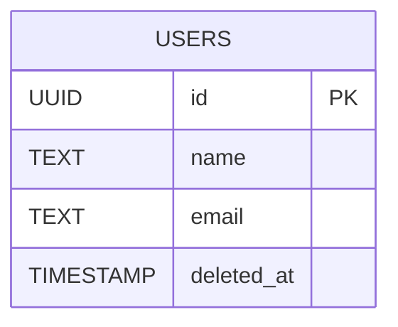
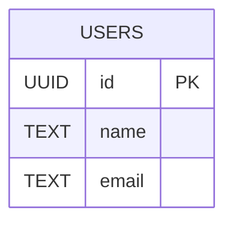
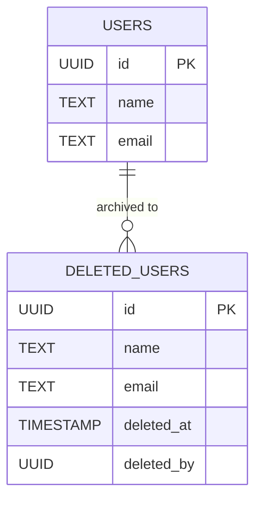

---

## はじめに

データベースにおける「削除」には、大きく分けて2つのアプローチがあります。

* **論理削除**：レコードを削除せず、`deleted` フラグや `deleted_at` カラムで「削除済み」と見なす
* **物理削除**：`DELETE` 文でレコードを削除する

「復元できるから論理削除」「事故が怖いから論理削除」など、こうした選択が無意識にされがちですが、それは本当にシステムの設計として最適なのでしょうか。

この記事では、筆者の実務経験を交えながら、削除の設計を**責務分離**や**アーキテクチャ**の視点から見直してみます。

---

## 実体験から考える削除設計

私はこれまでいくつかのサービスでデータベース設計を担当してきました。その中では、基本的に**物理削除**を採用していました。

理由は単純で、整合性やパフォーマンス、制約との整合を重視していたからです。履歴の必要なデータは、別テーブルに保存する方を責務として明確にしたいと考えていました。

しかし、ある現場に参画した際、私よりも経験年数の長いエンジニアが既におり、彼の「復元性を重視すべき」という方針から、**論理削除**を選定することになりました。

結果として、以下のような問題が発生しました。

* クエリすべてに `WHERE deleted_at IS NULL` をつける必要がある
* ユニーク制約や外部キーが扱いづらくなる
* フロントエンドやAPIで非表示を意識する必要があり、処理する箇所が増える
* 制約を活かすため削除状態にかかわらずチェックする処理が必要

結局、整合性を担保するために**物理削除のような処理を追加で行う**羽目になりました。

論理削除を採用したはずなのに、論理削除のままだと不都合があり、アプリケーション側で余計な制御を増やす結果となりました。

---

## 論理削除の構成図

### ✅ メリット

* 復元が簡単
* 削除ログとして使える
* 外部キー制約が壊れない

### ❌ デメリット

* すべてのクエリに `WHERE deleted_at IS NULL` が必要
* JOIN・集計・ユニーク制約が複雑になる
* 「削除されたこと」が曖昧になる

---

## 物理削除の構成図

### ✅ メリット

* クエリがシンプル
* パフォーマンスが安定
* 制約が直感的に機能する（UNIQUEなど）
* GDPRなど「完全削除」が求められる場面に強い

### ❌ デメリット

* 復元不可（ログやバックアップが必要）
* 誤削除への対策が別途必要

---

## 削除済みテーブルの構成図

### ✅ メリット

* クエリがクリーンなまま
* 削除履歴の責務を独立して管理できる
* ユニーク制約とバッティングしない
* 削除と復元を明確に扱える

---

## 削除設計の選び方

| 観点              | 論理削除 | 物理削除 | 削除済みテーブル |
| --------------- | ---- | ---- | -------- |
| 誤削除防止           | ✅    | ❌    | ✅        |
| クエリの簡潔さ         | ❌    | ✅    | ✅        |
| パフォーマンス         | ❌    | ✅    | ✅        |
| ユニーク制約との相性      | ❌    | ✅    | ✅        |
| GDPRなどの法対応      | ❌    | ✅    | ✅（条件付き）  |
| 「削除≠非表示」なビジネス要件 | ❌    | ✅    | ✅        |

---

## 結論：削除は「責務」で分ける

「論理削除＝安全」と思われがちですが、実際にはアプリケーション全体の設計に複雑さを持ち込みやすくなります。

* **削除**の責務：データの完全除去、整合性の担保
* **非表示**の責務：UI表示の制御、ソート・フィルタ
* **履歴**の責務：削除ログ、監査

それぞれを明確に分離し、次のような設計が最もシンプルです。

* 表示制御は `is_active` フラグで管理
* 本当に削除したい場合は物理削除
* 復元・監査が必要なものは別テーブルで保持

---

## おわりに

削除は設計思想が現れるトピックの1つです。経験豊富なエンジニアの意見も大切ですが、自分の設計に責任を持つ以上は**直感だけでなく責務分離の観点で選択する**ことが重要です。

「削除」がアプリケーションにどんな意味を持つのか、ぜひ一度見直してみてください。
