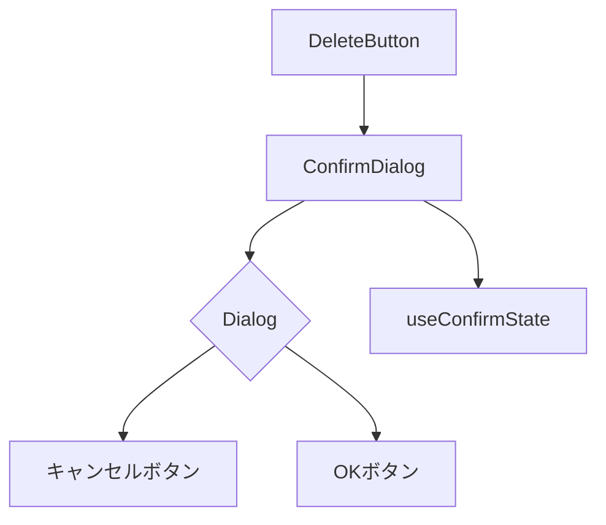
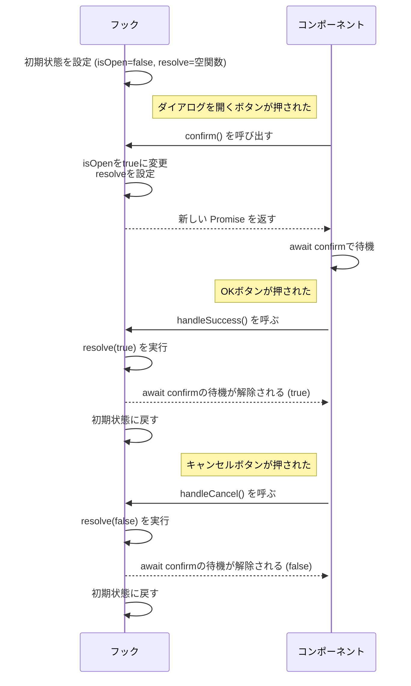
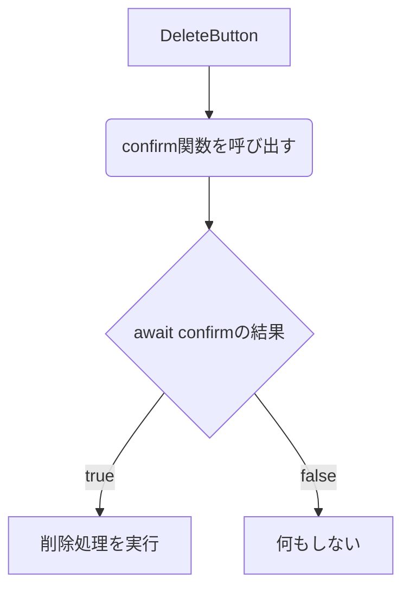

## はじめに

ブラウザ標準の`window.confirm`を使ったことはありますか？

最もシンプルな確認ダイアログを表示する方法です。
戻り値がboolean型であり、OKボタンが押された場合はtrue、キャンセルボタンが押された場合はfalseを返します。
カスタムフックで表現するとこんな感じ。

```ts:**/components/delete-button.tsx
const useConfirm = (message: string, onConfirm: () => void) =>
  useCallback(() => {
    const result = window.confirm(message);
    if (result) onConfirm();
  }, [message, onConfirm]);

export const DeleteButton: FC = () => {
  const handleClick = useConfirm("削除しますか？", () => console.log("削除処理を実行"));
  return <button onClick={confirm}>削除</button>;
};
```

このAPIが優れているのは、ダイアログの見た目や開閉状態の管理を内部でやってくれているため、はいが選ばれたときに何をしたいのか、どんなメッセージを表示させるのかのみに集中できる点です。

このように、実装者がダイアログの見た目や挙動を気にすることなく、簡単に使えるAPIを作ることができれば、開発効率が向上します。
UIフレームワークのDialog系コンポーネントでもこのAPIを実現できないでしょうか？

```tsx:**/components/delete-button.tsx
import { ConfirmDialog } from "@/ui/confirm";
import { Button } from "@yamada-ui/react";
import { type ElementRef, type FC, useCallback, useRef } from "react";

export const DeleteButton: FC = () => {
  const ref = useRef<ElementRef<typeof ConfirmDialog>>(null);

  const handleClick = useCallback(async () => {
    const result = await ref.current?.confirm();
    if (result) {
      console.log("削除処理を実行");
    }
  }, []);

  return (
    <>
      <Button onClick={handleClick}>削除</Button>
      <ConfirmDialog ref={ref}>削除しますか？</ConfirmDialog>
    </>
  );
};
```

`Promise`と`useImperativeHandle`で、このようなAPIを実現できます！


:::details　一般的に使用されているダイアログの使い方

```tsx:**/components/delete-button.tsx
import { Button, Dialog, useDisclosure } from "@yamada-ui/react";
import { type FC, useCallback } from "react";

export const DeleteButton: FC = () => {
  const { isOpen, onOpen, onClose } = useDisclosure();

  const handleSuccess = useCallback(() => {
    console.log("削除処理を実行");
    onClose();
  }, [onClose]);

  return (
    <>
      <Button onClick={onOpen}>Open</Button>
      <Dialog
        isOpen={isOpen}
        onClose={onClose}
        cancel={<Button onClick={onClose}>キャンセル</Button>}
        success={
          <Button bg={"blue.500"} onClick={handleSuccess}>
            OK
          </Button>
        }
      >
        本当に削除しますか？
      </Dialog>
    </>
  );
};
```

コンポーネント名はボタンなのに、`useDisclosure`で謎の開閉状態が露呈していますね。
ダイアログの開閉状態を同じようなコンポーネントを作成するたびに毎回組み付ける必要があります。
この例では処理が記載されておらず、ダイアログの中身も1行ですが、実際の開発では複雑な処理や複数のコンポーネントが含まれることもあります。
ダイアログの中にダイアログが入ることもあるかもしれません。
ダイアログとそれに使用される状態は必ずセットで使われるべきもののため、それらが単独でインポート可能なAPIを作ることが望ましいです。
共通であり、単調な処理を隠蔽してあげることで何をしたいのかが明確になります。

:::
いかがでしょうか。
コンポーネントは、`confirm`関数のみを親コンポーネントに公開し、ダイアログの状態管理は内部で行うようにしました。
`window.confirm`のように、削除ボタンが押されたときに期待する処理と、ダイアログ内に表示したい内容に集中することができるようになりました。

## 実装

内部の実装を紹介していきます。

- コンポーネントの依存関係



### 状態管理

```ts:ui/confirm/hooks.ts
import { useCallback, useState } from "react";

/** 状態の型定義 */
type State = {
  isOpen: boolean;
  resolve: (isSuccess: boolean) => void;
};

/** 初期状態 */
const initialState: State = {
  isOpen: false,
  resolve: () => {},
};

/** 確認ダイアログの開閉状態を管理するカスタムフック */
export const useConfirmState = () => {
  const [{ isOpen, resolve }, setState] = useState<State>(initialState);

  const confirm = useCallback(
    () =>
      new Promise<boolean>((resolve) => {
        setState({ isOpen: true, resolve });
      }),
    [],
  );

  const handleSuccess = useCallback(() => {
    resolve(true);
    setState(initialState);
  }, [resolve]);

  const handleCancel = useCallback(() => {
    resolve(false);
    setState(initialState);
  }, [resolve]);

  return {
    /** ダイアログの開閉状態 */
    isOpen,
    /** ダイアログを開き、ユーザーの確認結果が決まるまで待機する非同期関数 */
    confirm,
    /** ダイアログのOKボタンが押されたときの処理 */
    handleSuccess,
    /** ダイアログのキャンセルボタンが押されたときの処理 */
    handleCancel,
  };
};
```

ダイアログコンポーネント内で使用する状態を管理するカスタムフックです。
このHooksの処理の流れをイメージしてみましょう。



0. コンポーネントのマウントと共に、初期状態が設定されます。
   isOpenはダイアログが閉じられている状態としてfalseを設定, resolveはまだ無いため、空の関数を設定。
1. ボタンが押されて`confirm`関数が呼ばれます。
   ダイアログを表示するべく、isOpenをtrueに変更し、resolve関数を設定。
   この`resolve`が呼ばれるまでは`await confirm()`が待ち続けるため、ダイアログが閉じられるまで処理が進みません。
2. ダイアログのどちらかのボタンが押されます。
   このとき、stateに保持していたresolve関数が呼ばれます。
   ここで渡した引数が、`await confirm()`の返り値として返り、Promiseが解決されることになります。
   最後に、ダイアログを閉じるため、`setState(initialState)`でstateを初期状態に戻しています。



ユーザーがボタンを押すまでの状態と、どちらが押されたのかをPromiseの解決で表現することで、`window.confirm`のようなユーザーの操作が行われるまで待機するAPIを実現できました！

### コンポーネントライブラリへの組付け

:::message
[Yamada UI](https://yamada-ui.com/ja)の`Dialog`を使用して説明していますが、もちろん他のダイアログ系のコンポーネントでも同様の実装が可能です。
ドキュメントとコンポーネントが充実したおすすめのUIライブラリです！
:::

```tsx:ui/confirm/index.tsx
import { Button, Dialog } from "@yamada-ui/react";
import { useImperativeHandle, forwardRef, type ComponentProps } from "react";
import { useConfirmState } from "./hooks";

/** 親コンポーネントに公開する関数 */
type Handle = { confirm: () => Promise<boolean> };
/** 親コンポーネントに渡されるProps */
type Props = Omit<ComponentProps<typeof Dialog>, "isOpen" | "onClose" | "cancel" | "success">;

export const ConfirmDialog = forwardRef<Handle, Props>((props, ref) => {
  const { isOpen, confirm, handleSuccess, handleCancel } = useConfirmState();
  useImperativeHandle(ref, () => ({ confirm }), [confirm]);

  return (
    <Dialog
      onClose={handleCancel}
      cancel={<Button onClick={handleCancel}>キャンセル</Button>}
      success={
        <Button bg={"blue.500"} onClick={handleSuccess}>
          OK
        </Button>
      }
      {...{isOpen, ...props}}
    />
  );
});
```

複雑な状態管理を隠蔽したため、コンポーネントへの状態の組付けが簡単になりました。
`ref`を親に渡してもらうために、`forwardRef`を使っています。
`forwardRef`の型定義は複雑ですが、上記のように、第一型引数が公開するメソッドの型、第二型引数が親コンポーネントに渡してもらいたいPropsの型となります。
そして`useImperativeHandle`を使うことで、useRef経由で親コンポーネントが子コンポーネントのメソッドを呼び出すことができるようになります。
よく、DOMコンポーネントのメソッドを呼ぶ方法として`useRef`を使うことがありますが、カスタムコンポーネントでもメソッドを公開できるんですね。
`useImperativeHandle`の第一引数には親から渡された`ref`、第二引数には公開するメソッドを入れたオブジェクトを返す関数、第三引数には`useEffect`やメモ系hooksでお馴染みの依存する値を渡します。
まだ試せていませんが、2024年5月現在beta版がリリースされているReact19では`forwardRef`を使わずに`ref`を直接渡すことができるようになるので、より使いやすくなるでしょう。

## 発展

### Render Hooksパターンの問題点

この記事を書くにあたって参考にさせていただいた記事があり、それらの記事ではRender Hooksパターンを使うことを提示していました。
最後にあげていますので、興味がある方は参考にしてみてください。
ですが、Render Hooksパターンでは戻り値が関数コンポーネント(`React.FC`)の場合に、状態変更時に不要なコンポーネントアンマウントが発生してしまう問題があります。
状態が変更された際に即座にコンポーネントがアンマウントされるため、アニメーションが付いている場合、再生を待たずにダイアログが閉じてしまいます。

https://www.asobou.co.jp/blog/web/reactfc-renderhooks

この問題の解説は上記記事で詳しく書かれており、この方はコンポーネントを静的に定義し、別で返したPropsを使用側に注入させることで解決しているようです。
この方法では結局使用側が状態を組み付ける必要があるのと、使用側が不必要に状態にアクセスすることを許すことになってしまうのが難点です。
また、変数コンポーネント(`JSX.Element`)であればアンマウントは発生しませんが、そうなると使用側でコンポーネントに`children`含むPropsを当てることができなくなってしまいます。
今回のユースケースでは使用側に表示する内容を決めてもらう必要があるため、この方法も使えません。

そこで、`useImperativeHandle`を使う方法を考えました。
この記事を書き始めた当初はRender Hooksパターンでの実装を考えていましたが、実装する中でこの問題に気づき書き直しました。
宣言的に使用できないのは残念ですが、アニメーションが消えてしまうのは致命的な問題です。
一応元記事のようにRender Hooksパターンでの実装を下記に示しておきます。

:::details　Render Hooksパターンでの実装

```tsx:ui/confirm/index.tsx
import { Button, Dialog as Component } from "@yamada-ui/react";
import { useCallback, useMemo, type FC, type ComponentProps } from "react";
import { useConfirmState } from "./hooks";

export const useConfirm = () => {
  const { isOpen, confirm, handleOk, handleCancel } = useConfirmState();

  type Props = Omit<ComponentProps<typeof Component>, "isOpen" | "onClose" | "cancel" | "success">;

  const Dialog: FC<Props> = 
    useCallback(
      (props) => (
        <Component
          onClose={handleCancel}
          cancel={<Button onClick={handleCancel}>キャンセル</Button>}
          success={
            <Button bg={"blue.500"} onClick={handleSuccess}>
              OK
            </Button>
          }
          {...{isOpen, ...props}}
        />
      ),
      [isOpen, handleCancel, handleSuccess],
    );
  return {
    Dialog,
    confirm,
  };
};
```

```tsx:**/components/delete-button.tsx
import { useConfirm } from "@/ui/confirm";
import { Button } from "@yamada-ui/react";
import { type FC, useCallback } from "react";

export const DeleteButton: FC = () => {
  const { Dialog, confirm } = useConfirm();

  const handleClick = useCallback(async () => {
    const result = await confirm();
    if (result) {
      console.log("削除処理を実行");
    }
  }, [confirm]);

  return (
    <>
      <Button onClick={handleClick}>削除</Button>
      <Dialog>本当に削除しますか？</Dialog>
    </>
  );
};
```

アニメーションが無い場合はRender Hooksパターンで実装しても正常に動作しますが、コンポーネントライブラリでアニメーションが付いていないことは基本的には無いと思われます。
出現時はエフェクトが付いているのに、消えるときに突然消えるのはユーザーにとっても不自然です。
また、不必要にコンポーネントのアンマウントが発生することはパフォーマンス上好ましくありません。
:::

<!-- ### HTMLのdialog要素を使った実装 -->
### ダイアログ非表示時に不要な再レンダリングを発生させない方法

ダイアログの中身にContextを使うと、ダイアログが非表示のときにも再レンダリングが発生してしまいます。
これを防ぐには、中に表示される内容をコンポーネントに分離し、動的インポートすると良いです。

```tsx:delete-button.tsx
import { ConfirmDialog } from "@/ui/confirm";
import { Button } from "@yamada-ui/react";
import { type ElementRef, type FC, lazy, useCallback, useRef } from "react";

export const DeleteButton: FC = () => {
  const ref = useRef<ElementRef<typeof ConfirmDialog>>(null);

  const handleClick = useCallback(async () => {
    if (await ref.current?.confirm()) {
      console.log("削除処理を実行");
    }
  }, []);

  const ItemInformation = lazy(() => import("./ItemInformation"));

  return (
    <>
      <Button onClick={handleClick}>削除</Button>
      <ConfirmDialog ref={ref}>
        <ItemInformation />
      </ConfirmDialog>
    </>
  );
};
```

## まとめ

ダイアログの状態管理を隠蔽することで、ダイアログの見た目や挙動に集中できるAPIを作ることができました。
Render Hooksパターンを推す記事として書こうと思っていたのですが、実装する中でアニメーションが消えてしまう問題があることを知り、`useImperativeHandle`を使う方法を提案しました。
このフック自体があまり知られていないような気がするので、ぜひ使ってみてください。

## 参考

- 発案者(おそらく)の記事

https://medium.com/@kch062522/useconfirm-a-custom-react-hook-to-prompt-confirmation-before-action-f4cb746ebd4e

- 丁寧な解説記事

https://qiita.com/Yametaro/items/b6e035fe06530a9f47bc

- Promiseを使うことの意義を、凝集度と結合度の観点から解説されている記事

https://zenn.dev/yumemi_inc/articles/f6ec17edf13670
